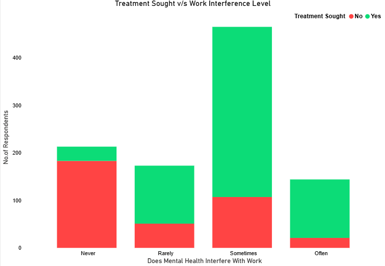
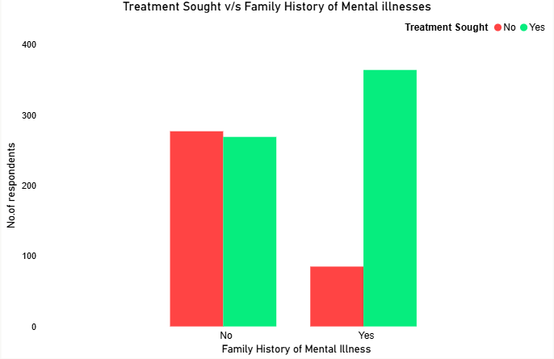
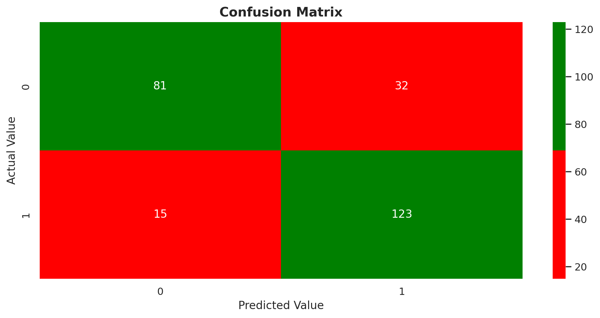
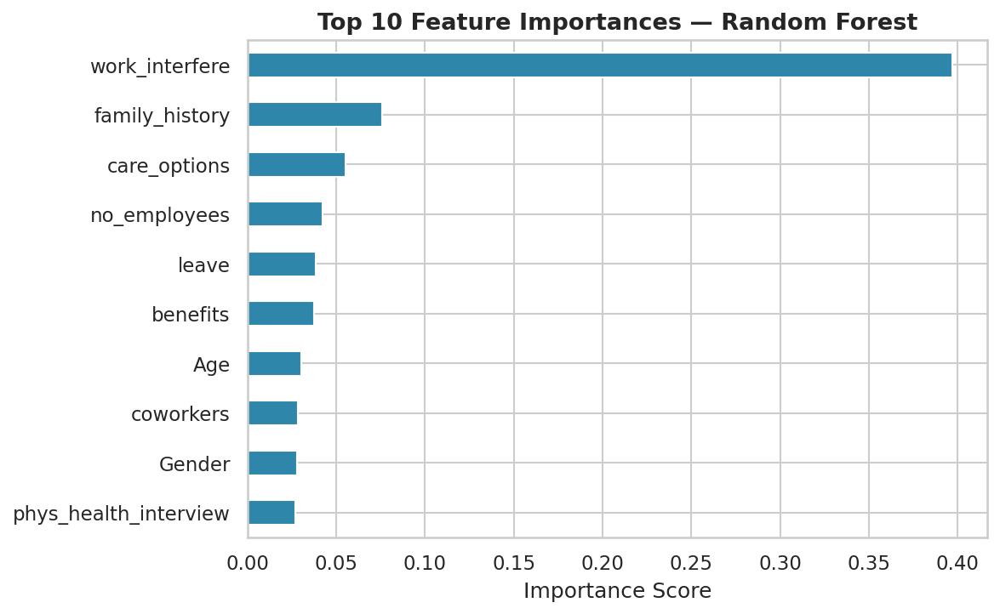

# Mental Health Treatment Predictor

A machine learning project that predicts whether a tech industry 
worker is likely to seek mental health treatment, based on workplace 
and personal survey data.

---

## Project Overview

Mental health conditions affect 1 in 5 tech workers globally — yet 
most never seek treatment. This project uses a Random Forest 
classifier trained on real survey data to identify individuals likely 
to seek treatment, based on 26 workplace and personal features.

**Model accuracy: 81.27% on unseen test data**

---

## Dataset

- **Source:** OSMI Mental Health in Tech Survey 2014
- **Link:** https://www.kaggle.com/datasets/osmi/mental-health-in-tech-survey
- **Size:** 1,257 respondents · 27 features
- **Target variable:** treatment (Yes / No) — balanced 50.6% / 49.4%

---

## Project Structure

```
mental health treatment predictor/
│
├── mental_health_predictor.ipynb   # Full analysis notebook
├── survey.csv                      # Dataset
├── requirements.txt                # Required libraries
└── images/                         # Exported visualisations
├── work_interference.png
├── family_history.png
└── confusion_matrix.png
```

---

## Methodology

| Phase | Description |
|---|---|
| Data cleaning | Fixed age outliers, consolidated 49 gender entries, handled missing values |
| EDA | Visualised treatment patterns by work interference and family history |
| Preprocessing | Label encoded all categorical features, 80/20 train-test split |
| Modelling | Random Forest Classifier — 100 trees, max depth 10 |
| Evaluation | Accuracy score, confusion matrix, classification report |
| Live prediction | Real-time prediction on new individual inputs |

---

## Results

| Metric | Score |
|---|---|
| Accuracy | 81.27% |
| Precision (Treatment class) | 0.79 |
| Recall (Treatment class) | 0.89 |
| F1-Score (Treatment class) | 0.84 |

The model correctly identified **89% of all actual treatment-seekers** 
in the test set. When wrong, it tends toward false alarms rather than 
missed cases — the safer error in a mental health context.

---

## Key Findings

- Work interference is the strongest behavioural predictor of 
  treatment-seeking
- Family history significantly increases the likelihood of 
  seeking treatment
- Employer-provided mental health benefits influence 
  treatment-seeking behaviour

  ---

  ## Visualizations

  ### Work Interference v/s Treatment Seeking
  

  ### Family History Impact
  

  ### Confusion Matrix
  

  ### Feature Importance
  

---

## Libraries Used

- Python 3
- Pandas — data manipulation
- NumPy — numerical operations
- Matplotlib & Seaborn — data visualisation
- Scikit-learn — machine learning

---

## How to Run

1. Clone the repository

   git clone https://github.com/AbH1-N/mental-health-treatment-predictor.git

2. Install dependencies

   pip install -r requirements.txt

3. Open the notebook
4. Run all cells in order

---

## Live Prediction

The final section of the notebook includes a live prediction demo — 
enter 22 survey responses and the model predicts whether that 
individual is likely to seek mental health treatment.

---

## Author

**ABHIN ASHOK**  
Data Analyst  
www.linkedin.com/in/abhinashokda  

---

## Acknowledgements

Dataset: Open Sourcing Mental Illness (OSMI)  
https://osmihelp.org
